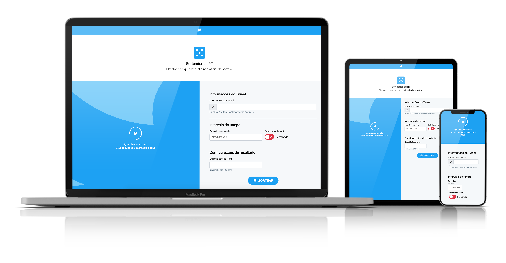

# **Sorteador de RT**

Este projeto é uma plataforma experimental e não oficial de sorteio espontâneo.  
A ideia para criação surgiu da participação de um evento onde era necessário um sorteio baseado no retweet de um post específico e foi difícil encontrar uma ferramenta que o fizesse.

## **O que esperar desta aplicação?**

Na tentativa de resolver o problema citado na introdução foi criado um formulário onde é possível inserir a URL de um tweet juntamente com a data e de maneira opcional um horário.

Premissas relacionadas ao `produto`: 

- Seguindo a lógica de um sorteio que ocorreria durante ou logo ao final de um evento, a aplicação só aceita uma data e a API do Twitter só trará resultados de até 7 dias passados a partir da data atual;
- Preenchimento fácil dos campos proporcionando agilidade para o usuário;
  - Isso inclui preocupações com validação, máscaras, rótulos, textos descritivos e acessibilidade (contraste de cores, navegação do teclado, utilização de tecnologias assistivas);
- Seguir a identidade visual do Twitter mas não utilizar o Bootstrap mas sim recriar os componentes que fossem necessários;

Premissas `técnicas`:

- Utilizar a API `v1.1` disponibilizada pelo Twitter para buscar as informações;
  - A versão `v1.1` da API será considerada obsoleta em nov/2020;
  - Atualmente o número máximo de resultados por sorteio é 100 usuários devido ao limite da API, isso mudará com o surgimento da `v2.0` por parte do Twitter;
- Utilizar stack Javascript:
  - Node.js com Express para realizar chamadas server-side que necessitam de Bearer Token sem expor dados sensíveis(chaves de autenticação);
  - React com [Create React App](https://github.com/facebook/create-react-app) no front por ser uma aplicação simples e não haver preocupações relacionados à SEO e server-side rendering;
- Menor número de dependências possível;
- Cobrir todos os pontos da lista de [TODO.md](TODO.md).

## **Stack**

- [React & ReactDOM](https://pt-br.reactjs.org/) (Biblioteca de componentes)
- [Styled Components](https://styled-components.com/) (CSS-in-JS);
- [Box Icons](https://boxicons.com/) (biblioteca padrão de ícones de onde foram retirados os svgs)
- [ExpressJS](https://expressjs.com/pt-br/) (framework para Node.js)
- [Axios](https://github.com/axios/axios) (HTTP client para realização de chamadas client-side e server-side)

## **Arquivos .env**

Para rodar esta aplicação é necessária uma chave de autenticação do Twitter.

Existe um arquivo chamado `env.example.js` onde deve ser inserida a chave e o mesmo deve ser renomeado para `env.js`.

A solicitação da chave pode ser feita no [portal de desenvolvedor do Twitter](https://developer.twitter.com/en/apply-for-access) e demorar alguns dias para ser aprovada.

## Instalação:

É necessário ter no mínimo Node.js instalado na sua máquina.  
A instalação pode ser realizada via [NVM (Node Version Manager)](https://github.com/nvm-sh/nvm) ou [diretamente no site do Node.js](https://nodejs.org/en/).

Se você já tem o Node.js instalado, prossiga:

- Copie o repositório;
- Instale as dependências com: `npm run install` ou `yarn install`;

## Rodando sem Docker:

- Abra uma aba num terminal de sua preferência (Terminal, Prompt, iTerm);
- Certifique-se de estar na pasta do projeto;
- Vamos subir o servidor com o comando: `node server.js`;
  - Se a execução ocorrer corretamente você receberá o feedback: `Listening on port 3001`
- Em outra aba do terminal rodaremos a aplicação com o comando: `npm start` ou `yarn start` 
  - Se tudo estiver correto, uma janela abrirá em seu navegador com a url `http://localhost:3000`

## Rodando com Docker:

**Em breve.**

---

## Documentação original do Create React App para consulta

In the project directory, you can run:

### `npm start` ou `yarn start`

Runs the app in the development mode. 
Open [http://localhost:3000](http://localhost:3000) to view it in the browser.

The page will reload if you make edits. 
You will also see any lint errors in the console.

### `npm test` ou `yarn test`

Launches the test runner in the interactive watch mode. 
See the section about [running tests](https://facebook.github.io/create-react-app/docs/running-tests) for more information.

### `npm build` ou `yarn build`

Builds the app for production to the `build` folder. 
It correctly bundles React in production mode and optimizes the build for the best performance.

The build is minified and the filenames include the hashes. 
Your app is ready to be deployed!

See the section about [deployment](https://facebook.github.io/create-react-app/docs/deployment) for more information.

### `npm eject` ou `yarn eject`

**Note: this is a one-way operation. Once you `eject`, you can’t go back!**

If you aren’t satisfied with the build tool and configuration choices, you can `eject` at any time. This command will remove the single build dependency from your project.

Instead, it will copy all the configuration files and the transitive dependencies (Webpack, Babel, ESLint, etc) right into your project so you have full control over them. All of the commands except `eject` will still work, but they will point to the copied scripts so you can tweak them. At this point you’re on your own.

You don’t have to ever use `eject`. The curated feature set is suitable for small and middle deployments, and you shouldn’t feel obligated to use this feature. However we understand that this tool wouldn’t be useful if you couldn’t customize it when you are ready for it.

### Learn More

You can learn more in the [Create React App documentation](https://facebook.github.io/create-react-app/docs/getting-started).

To learn React, check out the [React documentation](https://reactjs.org/).

#### Code Splitting

This section has moved here: https://facebook.github.io/create-react-app/docs/code-splitting

#### Analyzing the Bundle Size

This section has moved here: https://facebook.github.io/create-react-app/docs/analyzing-the-bundle-size

#### Making a Progressive Web App

This section has moved here: https://facebook.github.io/create-react-app/docs/making-a-progressive-web-app

#### Advanced Configuration

This section has moved here: https://facebook.github.io/create-react-app/docs/advanced-configuration

#### Deployment

This section has moved here: https://facebook.github.io/create-react-app/docs/deployment

#### `yarn build` fails to minify

This section has moved here: https://facebook.github.io/create-react-app/docs/troubleshooting#npm-run-build-fails-to-minify
